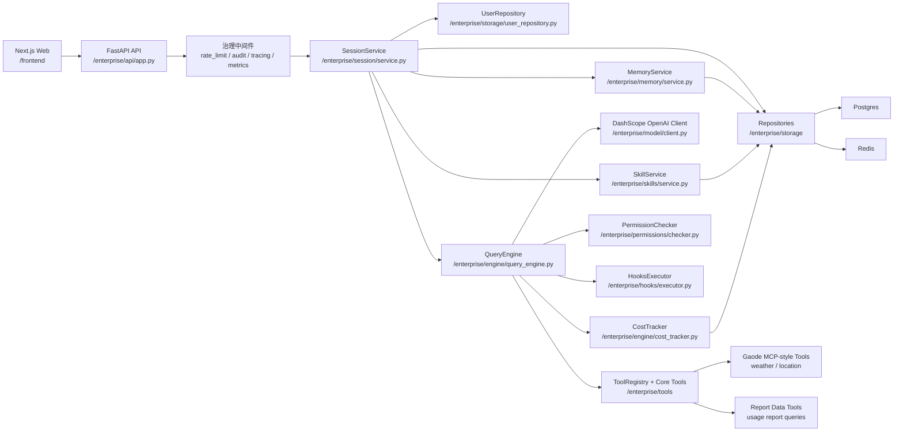
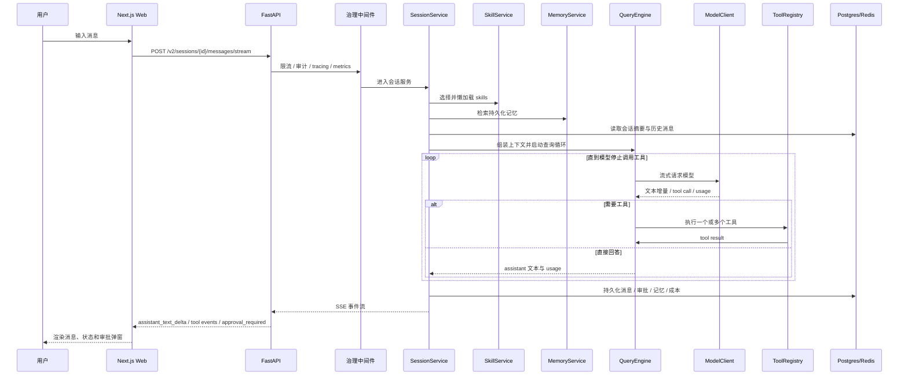
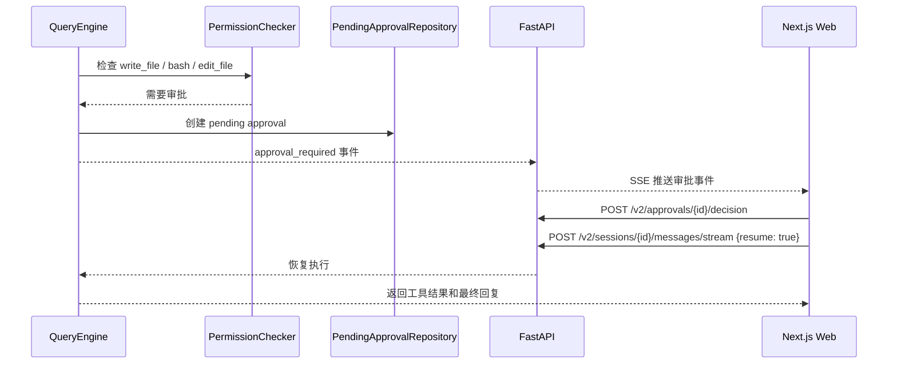

# Agent Enterprise Guide

## 架构概览

当前工程已经从旧 `ReAct + rag + agent.tools` 迁移为会话型 Agent 系统。主 UI 是独立的 Next.js Web 应用，后端以 FastAPI `v2` API 为统一入口，核心执行链路集中在 `enterprise/`。



## 聊天与工具调用链路



## 审批挂起与恢复



## 模块职责

- `frontend/`：Next.js + React + TypeScript Web UI，支持用户、会话、流式聊天和审批弹窗。
- `enterprise/api`：提供 `/v2/users`、`/v2/sessions`、`/v2/tools`、`/v2/skills`、`/v2/approvals` 等接口。
- `enterprise/session`：管理用户会话、消息历史、摘要、审批恢复和标题生成。
- `enterprise/engine`：负责消息模型、SSE 事件、流式工具调用循环和成本累计。
- `enterprise/model`：封装 DashScope OpenAI 兼容模型调用、重试和 usage 捕获。
- `enterprise/tools`：提供文件、检索、网页、高德天气/定位、报告数据等工具。
- `enterprise/skills`：负责 skill manifest 索引、模型选择和 `SKILL.md` 懒加载。
- `enterprise/memory`：负责持久化记忆提取与检索。
- `enterprise/governance`：提供限流、审计、Tracing、Prometheus 指标和成本落库。
- `enterprise/storage`：提供 Postgres 与 Redis 仓储访问。

## 当前接口

- `POST /v2/users`
- `GET /v2/users`
- `GET /v2/users/{user_id}`
- `PATCH /v2/users/{user_id}`
- `POST /v2/sessions`
- `GET /v2/sessions?user_id=...`
- `GET /v2/sessions/{session_id}`
- `GET /v2/sessions/{session_id}/messages`
- `POST /v2/sessions/{session_id}/messages/stream`
- `GET /v2/skills`
- `GET /v2/tools`
- `GET /v2/approvals?status=pending`
- `POST /v2/approvals/{approval_id}/decision`
- `GET /healthz`
- `GET /metrics`
- `GET /v1/metrics`

## Docker 验证

```powershell
docker compose --project-directory . -f docker/docker-compose-dev.yaml up -d --build
docker exec cdky-agent-api sh -lc 'cd /app && PYTHONPATH=/app pytest -q'
docker run --rm -v D:\work\cdky_agent\frontend:/app -w /app node:20-alpine sh -lc "npm ci && npm test && npm run build"
```
