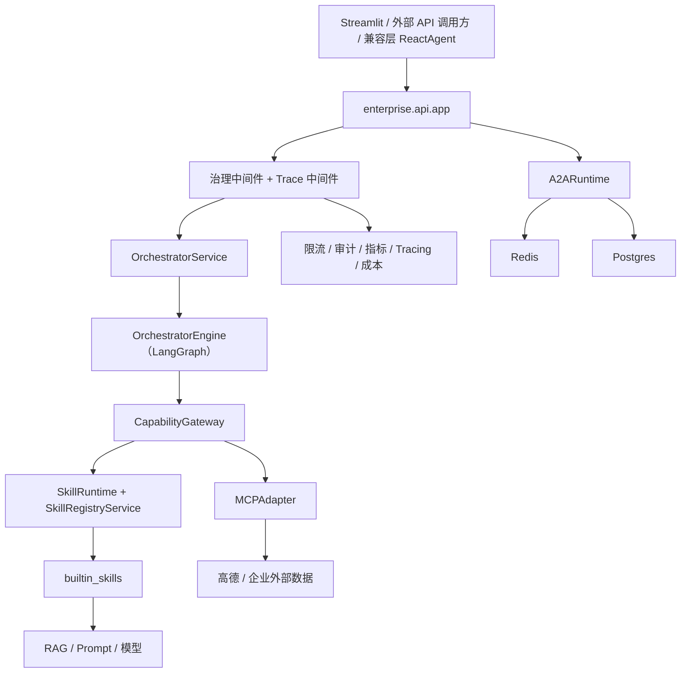
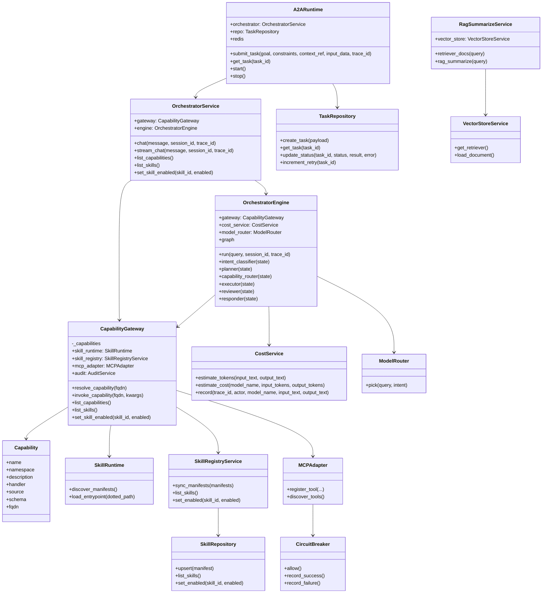
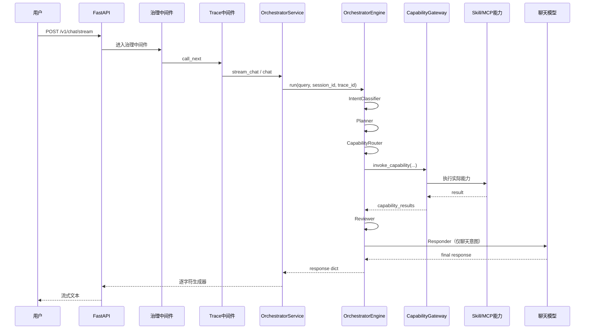
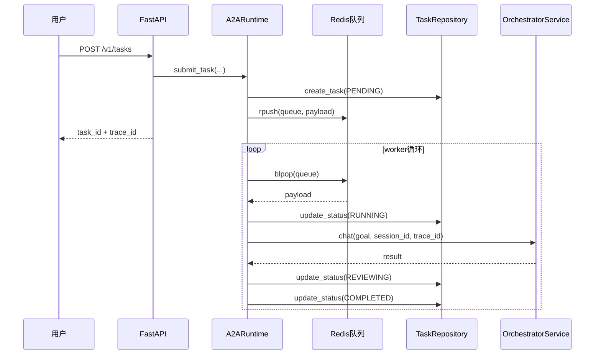
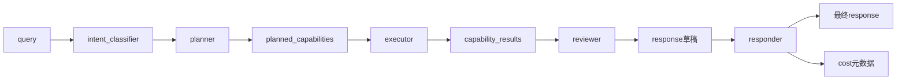
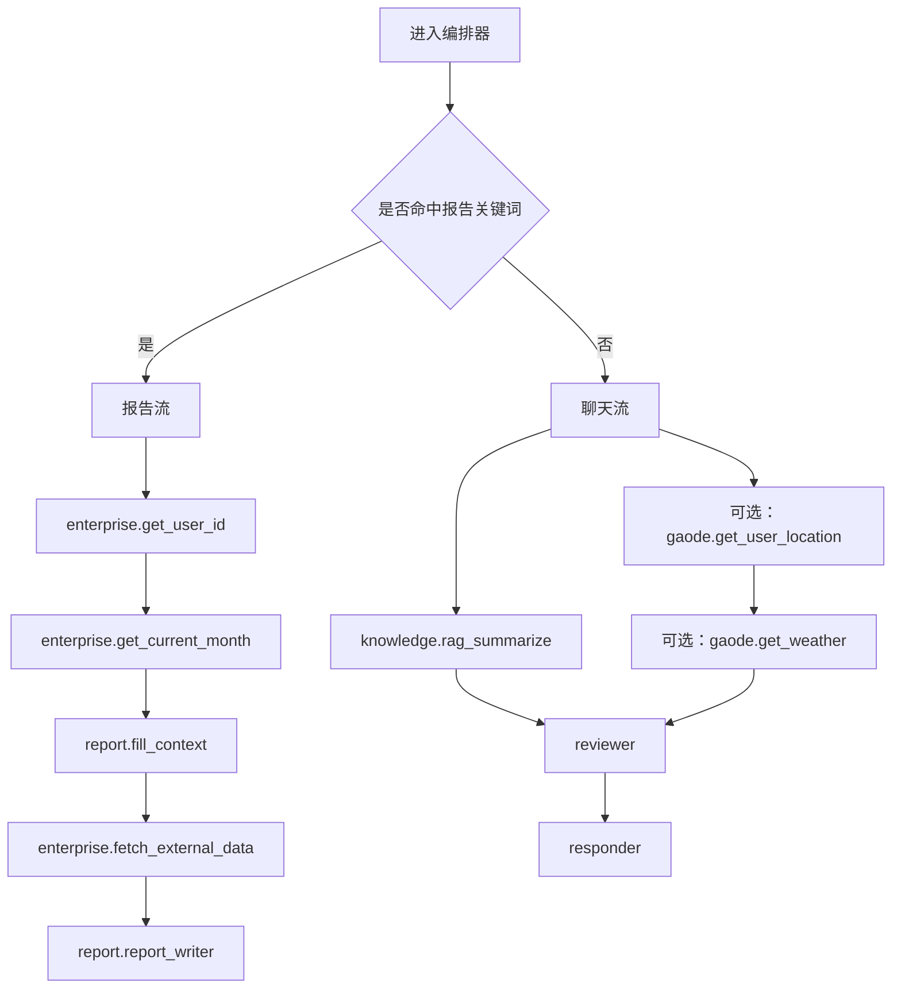

# 代码阅读总览

## 1. 阅读目标

这份文档用于帮助你从“系统整体”角度理解这个 Agent 工程。建议你带着下面四个问题去看代码：

1. 请求从哪里进入系统
2. 请求如何被编排成能力调用计划
3. 能力结果如何被汇总成最终响应
4. 状态、任务、审计、指标最终落到哪里

当前项目是 `API-first` 架构，真正的主线实现位于 `enterprise/` 目录。`agent/` 下的大部分内容要么是兼容层，要么是被企业版运行时复用的遗留工具实现。

## 2. 推荐阅读顺序

1. `enterprise/api/app.py`
2. `enterprise/orchestrator/service.py`
3. `enterprise/orchestrator/engine.py`
4. `enterprise/capability/gateway.py`
5. `enterprise/capability/builtin_skills.py`
6. `enterprise/a2a/runtime.py`
7. `enterprise/governance/*.py`
8. `enterprise/storage/*.py`
9. `rag/rag_service.py`
10. `rag/vector_store.py`
11. `utils/config_handler.py`

按这个顺序阅读，可以先看“请求怎么进来”，再看“请求怎么执行”，最后再看“数据怎么持久化与治理”。

## 3. 系统总图

## 4. 核心类图

这个系统更偏“组合关系”而不是“继承关系”，所以类图的重点在依赖关系。

## 5. 同步聊天调用时序

## 6. 异步任务调用时序

## 7. 编排状态流

## 8. 报告流与聊天流分叉图

## 9. 存储职责图

| 组件 | 存储介质 | 职责 |
|---|---|---|
| `skill_registry` | Postgres | 保存技能清单元数据与启用状态 |
| `a2a_tasks` | Postgres | 保存异步任务状态机 |
| `audit_events` | Postgres | 保存审计日志 |
| `cost_records` | Postgres | 保存成本估算记录 |
| `skill_registry:all` | Redis | 缓存技能注册表 |
| `metrics:*` | Redis | 保存轻量运行时指标 |
| `a2a:task_queue` | Redis | 异步任务队列 |
| `a2a:dead_letter` | Redis | 死信队列 |
| `chroma_db/` | Chroma 本地目录 | 保存向量化知识库 |

## 10. 阅读时最值得盯住的点

1. `OrchestratorEngine.planner()` 决定了“请求会调用哪些能力”。
2. `CapabilityGateway.invoke_capability()` 是理解能力执行链的核心入口。
3. `A2ARuntime._process_task()` 是理解异步状态流转的关键函数。
4. `SkillRuntime + SkillRegistryService + CapabilityGateway.reload()` 组成了“配置如何变成可执行能力”的主链。
5. `rag/vector_store.py` 与 `rag/rag_service.py` 说明了知识文件如何进入向量库，再进入模型上下文。

## 11. 关键设计说明

1. 虽然用了 LangGraph，但当前图结构是固定流水线，偏确定性编排。
2. 这套代码主要依赖对象组合关系，不靠深层继承。
3. `agent/react_agent.py` 只是兼容入口，`enterprise/` 才是当前权威主线。
4. A2A worker 是进程内线程，不是独立部署的外部 worker 服务。
5. `/v1/chat/stream` 目前是“先生成完整答案，再逐字符流出”，不是真正的模型原生流。

## POST /v1/chat/stream 的真实执行过程

1. 进程启动时，FastAPI(..., lifespan=lifespan) 先跑 lifespan，把服务对象挂到 app.state。
   enterprise/api/app.py (line 50) enterprise/api/app.py (line 64)
2. 请求进入中间件链。注册顺序是先 trace_context_middleware，后 governance_middleware，在 FastAPI/Starlette 的包装机制下，请求阶段实际先执行 governance。
   enterprise/api/app.py (line 100) enterprise/api/app.py (line 103)
3. governance_middleware 前置逻辑执行：读 x-api-key、限流、请求计数、inflight+1。
   enterprise/api/app.py (line 109) enterprise/api/app.py (line 117)
4. 然后 await call_next(request) 进入 trace_context_middleware：设置 ContextVar(trace_id/actor)，创建 span。
   enterprise/governance/tracing.py (line 86) enterprise/governance/tracing.py (line 91)
5. 进入路由 chat_stream：从 app.state 取 orchestrator_service，创建 generator = stream_chat(...)，返回 StreamingResponse(generator)。
   enterprise/api/app.py (line 185) enterprise/api/app.py (line 187)
6. 关键语法点：stream_chat 是生成器函数（有 yield），调用时只返回生成器对象，函数体并未立刻执行。
   enterprise/orchestrator/service.py (line 36)
7. 路由返回后，trace_context_middleware 后置逻辑先执行：写响应头 x-trace-id，并 reset ContextVar。
   enterprise/governance/tracing.py (line 104) enterprise/governance/tracing.py (line 106)
8. 再回到 governance_middleware 后置逻辑：记录 success 指标与 API 审计，inflight-1。
   enterprise/api/app.py (line 123) enterprise/api/app.py (line 127) enterprise/api/app.py (line 153)
9. 到真正开始发送 body 时，ASGI 才会迭代 generator，此时才触发 stream_chat 函数体：先 self.chat(...) 完整跑编排，再逐字符 yield。
   enterprise/orchestrator/service.py (line 42) enterprise/orchestrator/service.py (line 44)

10. self.chat(...) 内部执行 engine.run(...)，跑 LangGraph：IntentClassifier -> Planner -> CapabilityRouter -> Executor -> Reviewer -> Responder。
    enterprise/orchestrator/service.py (line 26) enterprise/orchestrator/engine.py (line 33)
11. Executor 调能力时统一走 CapabilityGateway.invoke_capability，做能力解析、调用、能力级审计/指标。
    enterprise/orchestrator/engine.py (line 161) enterprise/capability/gateway.py (line 126)
12. 结果返回后按字符流式输出给客户端（因此这是“先算完再流式展示”的字符流，不是模型 token 原生流）。
    enterprise/orchestrator/service.py (line 39)

------

关于你问的 state.orchestrator_service、state.a2a_runtime、state.audit_service：

1. 这些“服务类”本身定义在各自模块，比如：
   enterprise/orchestrator/service.py (line 15)
   enterprise/a2a/runtime.py (line 28)
   enterprise/governance/audit.py (line 10)
2. 但 app.state.orchestrator_service 这种“属性名”不是预先声明的字段，而是在 lifespan 里动态赋值时创建的。
   enterprise/api/app.py (line 64) enterprise/api/app.py (line 69)
3. 能直接赋值的原因是：app.state 是 FastAPI/Starlette 提供的通用状态容器（动态属性存储），语法上允许 app.state.xxx = ...。
4. 所以这里“定义位置”分两层：
   服务类型定义在各模块；state 上的成员名定义在 lifespan 的赋值语句。
5. 路由里的 orchestrator_service: OrchestratorService = app.state.orchestrator_service 只是本地变量+类型标注，不是给 state 定义字段。
   enterprise/api/app.py (line 187)