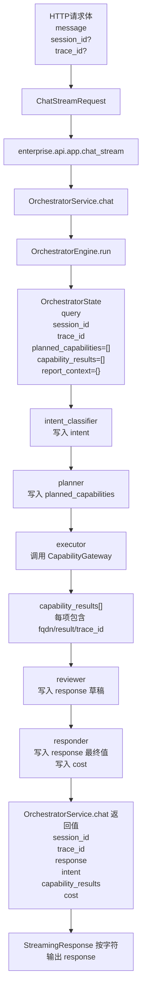
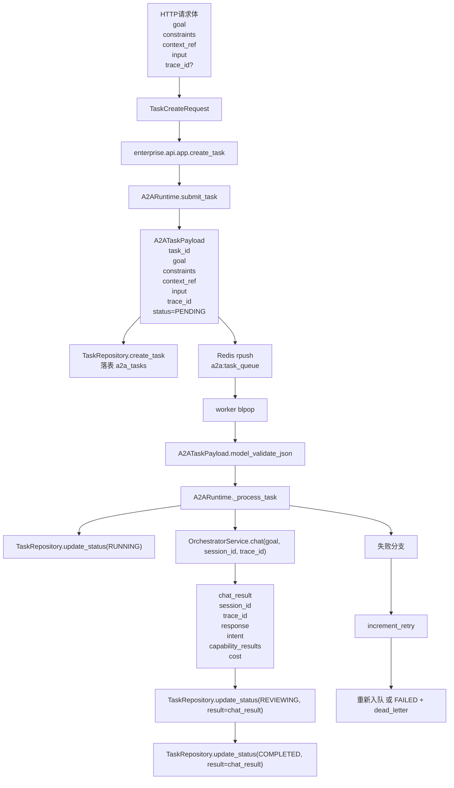
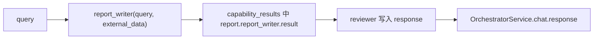
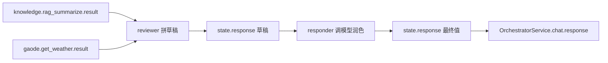

# 字段级数据血缘图

## 1. 这份图要解决什么问题

这份文档专门回答一个问题：

“一个请求进来以后，字段是怎样从 `request` 一路流到 `state`、`capability_results`，再流到 Postgres / Redis 的？”

如果你想排查：

- 某个字段从哪里来的
- 某个状态是谁写进去的
- 某个结果最后存到了哪里

那这份文档就是最直接的索引。

## 2. 同步聊天链路的字段血缘



## 3. 异步任务链路的字段血缘



## 4. 字段级拆解：同步聊天请求

### 4.1 请求字段进入点

入口文件：[app.py](/D:/workspace/proj/cdky_agent/enterprise/api/app.py)

| 来源 | 字段 | 进入位置 | 去向 |
|---|---|---|---|
| 请求体 | `message` | `ChatStreamRequest.message` | `OrchestratorService.chat(message=...)` |
| 请求体 | `session_id` | `ChatStreamRequest.session_id` | 若为空则在 `OrchestratorService.chat()` 内生成 |
| 请求体 | `trace_id` | `ChatStreamRequest.trace_id` | 若为空则优先取 `current_trace_id()` |
| 请求头 | `x-api-key` | `governance_middleware()` | 用作 `actor`，参与限流与审计 |
| 请求头 | `x-trace-id` | `trace_context_middleware()` | 写入上下文变量并回写响应头 |

### 4.2 `OrchestratorState` 初始化

初始化位置：[engine.py](/D:/workspace/proj/cdky_agent/enterprise/orchestrator/engine.py)

| `OrchestratorState` 字段 | 来源 | 写入函数 |
|---|---|---|
| `query` | `message` | `run()` |
| `session_id` | 请求体或自动生成 | `run()` |
| `trace_id` | 请求体、请求头或自动生成 | `run()` |
| `planned_capabilities` | 初始空列表 | `run()` |
| `capability_results` | 初始空列表 | `run()` |
| `report_context` | 初始空字典 | `run()` |

### 4.3 图执行中的字段演化

| 阶段 | 新写入字段 | 来源 |
|---|---|---|
| `intent_classifier()` | `intent` | 由 `query` 关键词判断 |
| `planner()` | `planned_capabilities` | 由 `intent + query` 决定 |
| `executor()` | `capability_results` | 由 `CapabilityGateway.invoke_capability()` 返回 |
| `_execute_report_flow()` | `report_context.user_id` | `enterprise.get_user_id` |
| `_execute_report_flow()` | `report_context.month` | `enterprise.get_current_month` |
| `reviewer()` | `response` | 由 `capability_results` 汇总 |
| `responder()` | `response` | 由模型润色结果覆盖 |
| `responder()` | `cost` | `CostService.record()` 返回 |

## 5. `capability_results` 的字段结构

这个字段是理解编排中间态的关键。

写入位置：
- 报告流：`_execute_report_flow()`
- 通用聊天流：`_execute_general_flow()`

结构如下：

```python
{
    "fqdn": "knowledge.rag_summarize",
    "result": "...",
    "trace_id": "..."
}
```

字段含义：

| 字段 | 含义 | 来源 |
|---|---|---|
| `fqdn` | 能力全限定名 | `plan[i]["fqdn"]` |
| `result` | 该能力的返回值 | `CapabilityGateway.invoke_capability()` |
| `trace_id` | 本次调用链追踪标识 | `state["trace_id"]` |

## 6. `CapabilityGateway` 内部字段流

入口文件：[gateway.py](/D:/workspace/proj/cdky_agent/enterprise/capability/gateway.py)

### 6.1 注册阶段

| 字段 | 来源 | 去向 |
|---|---|---|
| `manifest["id"]` | `SkillRuntime.discover_manifests()` | `SkillRegistryService.sync_manifests()` |
| `manifest["entrypoint"]` | manifest.json / 内置 manifest | `SkillRuntime.load_entrypoint()` |
| `capability.fqdn` | `Capability.namespace + name` | `_capabilities[fqdn]` |
| `enabled` | `skill_registry` 表 | 决定是否跳过加载 |

### 6.2 调用阶段

| 输入字段 | 处理位置 | 输出字段 |
|---|---|---|
| `fqdn` | `resolve_capability()` | `Capability` |
| `trace_id` | `invoke_capability()` | 审计日志、指标、返回结构 |
| `kwargs` | `cap.handler(**kwargs)` | `result` |
| `actor` | `current_actor()` | 审计日志 |

## 7. 异步任务字段如何落表

入口文件：[task_repository.py](/D:/workspace/proj/cdky_agent/enterprise/storage/task_repository.py)

### 7.1 `create_task()` 落表字段

| 表字段 | 来源 |
|---|---|
| `task_id` | `A2ATaskPayload.task_id` |
| `parent_task_id` | `A2ATaskPayload.parent_task_id` |
| `goal` | `A2ATaskPayload.goal` |
| `constraints` | `json.dumps(payload["constraints"])` |
| `context_ref` | `json.dumps(payload["context_ref"])` |
| `input` | `json.dumps(payload["input"])` |
| `result` | 初始为 `{}` |
| `status` | 初始为 `PENDING` |
| `error` | 初始空字符串 |
| `retry_count` | 初始为 `0` |
| `trace_id` | `A2ATaskPayload.trace_id` |
| `goal_hash` | `sha256(task_id + goal)` |
| `created_at` | `datetime.utcnow()` |
| `updated_at` | `datetime.utcnow()` |

### 7.2 `update_status()` 更新字段

| 场景 | 更新字段 |
|---|---|
| 进入运行中 | `status=RUNNING`, `updated_at` |
| 进入审核中 | `status=REVIEWING`, `result`, `updated_at` |
| 完成 | `status=COMPLETED`, `result`, `updated_at` |
| 失败 | `status=FAILED`, `error`, `updated_at` |

## 8. Redis 字段血缘

### 8.1 限流与配额

文件：[rate_limit.py](/D:/workspace/proj/cdky_agent/enterprise/governance/rate_limit.py)

| Redis Key | 来源字段 | 说明 |
|---|---|---|
| `ratelimit:{actor}:{minute_bucket}` | `x-api-key` | 每分钟限流桶 |
| `quota:{actor}:{day_bucket}` | `x-api-key` | 每日配额桶 |

### 8.2 异步任务

文件：[runtime.py](/D:/workspace/proj/cdky_agent/enterprise/a2a/runtime.py)

| Redis Key | 来源字段 | 说明 |
|---|---|---|
| `a2a:task_queue` | `A2ATaskPayload.model_dump_json()` | 待处理任务队列 |
| `a2a:dead_letter` | 失败 payload | 死信队列 |

### 8.3 运行时指标

文件：[metrics.py](/D:/workspace/proj/cdky_agent/enterprise/governance/metrics.py)

| Redis Key | 来源字段 | 说明 |
|---|---|---|
| `metrics:requests_total` | 请求计数 | API 总请求数 |
| `metrics:requests_success` | 请求计数 | API 成功数 |
| `metrics:requests_failed` | 请求计数 | API 失败数 |
| `metrics:tasks_submitted` | 任务计数 | 已提交任务数 |
| `metrics:tasks_running` | 任务计数 | 运行中任务数 |
| `metrics:tasks_completed` | 任务计数 | 已完成任务数 |
| `metrics:tasks_failed` | 任务计数 | 已失败任务数 |
| `metrics:cost:total` | 成本估算 | 成本累计值 |
| `metrics:cost:model_calls` | 模型名 | 模型调用次数哈希 |

### 8.4 技能注册表缓存

文件：[registry.py](/D:/workspace/proj/cdky_agent/enterprise/capability/skills/registry.py)

| Redis Key | 来源字段 | 说明 |
|---|---|---|
| `skill_registry:all` | `SkillRepository.list_skills()` | 技能注册表缓存 |

## 9. `response` 字段的最终来源

### 报告流



说明：
- 报告流不经过 `responder()` 的最终润色
- 所以最终 `response` 直接来自 `report.report_writer`

### 聊天流



## 10. 一句话总结整条血缘

### 同步聊天

`HTTP request -> ChatStreamRequest -> OrchestratorState -> planned_capabilities -> capability_results -> response/cost -> HTTP stream`

### 异步任务

`HTTP request -> TaskCreateRequest -> A2ATaskPayload -> Postgres(a2a_tasks) + Redis(queue) -> OrchestratorService.chat -> result -> Postgres(a2a_tasks.result)`
