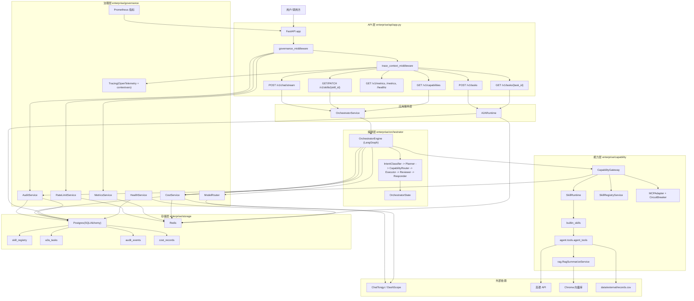
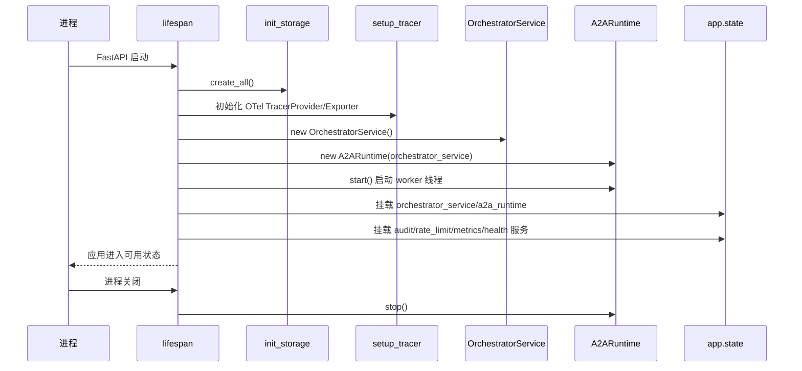
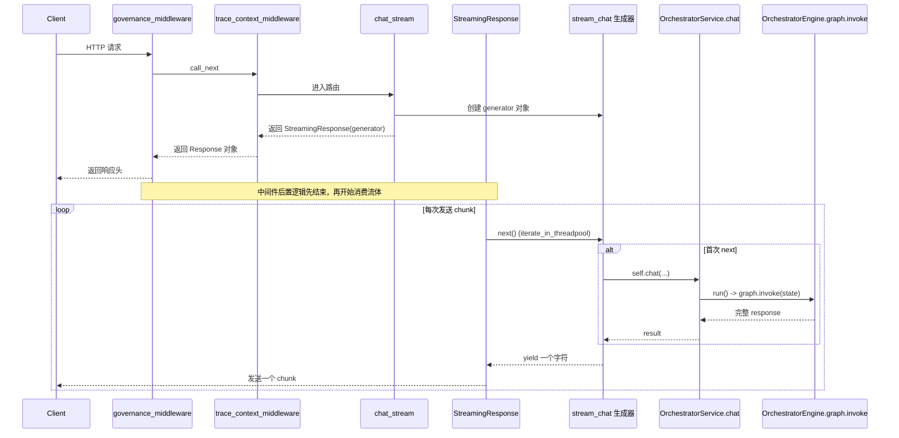
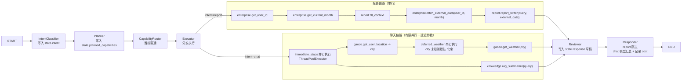
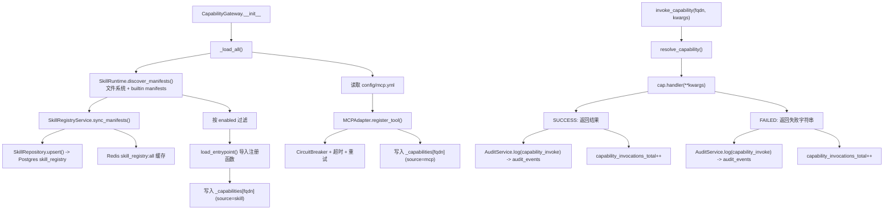
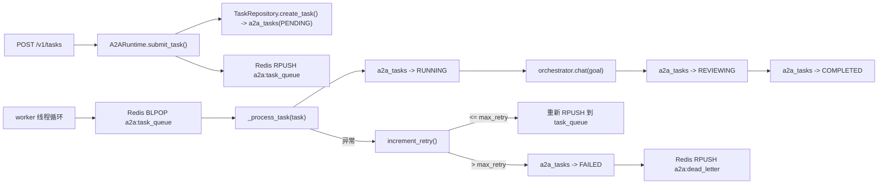
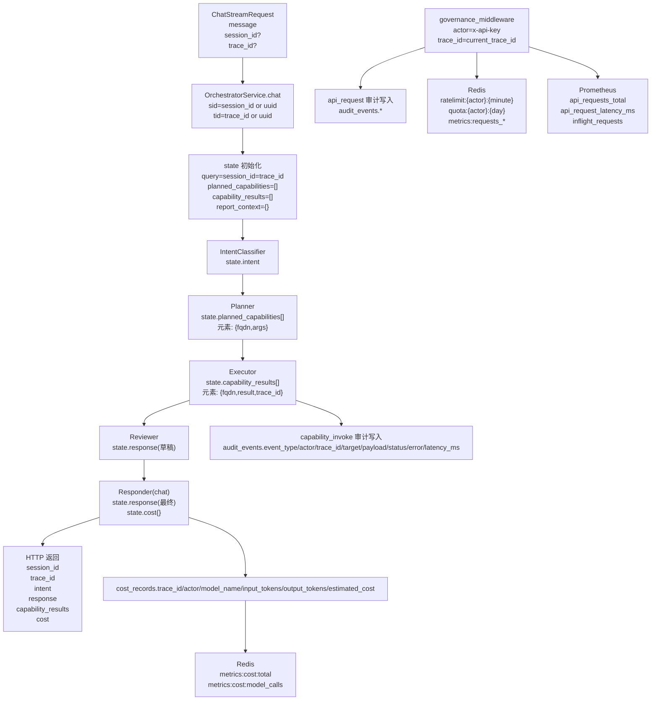

# Enterprise Agent 架构图（代码实况版）

> 说明：本文件以当前代码实现为准，不依赖可能滞后的历史文档。

## 1. 总体分层架构图

## 2. 启动与生命周期图（`lifespan`）

## 3. `POST /v1/chat/stream` 真实时序图

## 4. LangGraph 编排详图

## 5. 能力加载与调用架构图

## 6. A2A 异步任务架构图

## 7. 字段级数据血缘图（`request -> state -> capability_results -> DB/Redis`）

